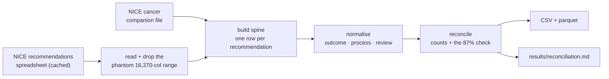

# HTA Decision Engine

[](https://github.com/belalzaky/hta-decision-engine/actions/workflows/ci.yml)

A public, reproducible dataset and model of every **NICE technology appraisal** — what was
submitted, what the evidence review group objected to, and what actually predicts whether a
medicine is recommended, restricted or rejected.

**Current state: Lap 1 (the spine) and Lap 2a (the overview-page cache) are done.** One tidy
table, one row per recommendation, rebuilt offline from NICE's own published spreadsheet with
every count reconciled and the normalisation checked against a figure NICE publishes itself —
plus a polite, resume-safe cache of the guidance overview page for every appraisal in it.

## The table

**1531 recommendations across 1181 appraisals**, 1999/00 to 2026/27.



The unit of analysis is the **recommendation, not the appraisal** — 1531 sit under 1181 because
multi-technology and multi-population appraisals split, so counting appraisals silently loses
**350 recommendations (23%)**.

Nineteen fields: identity and provenance, then NICE's own words untouched, then the
normalisations beside them. Full definitions and sources in
[`docs/data-dictionary.md`](docs/data-dictionary.md).

| Grain | Rows | Appraisals | Verbatim fields | Derived fields |
|---|---|---|---|---|
| recommendation | 1531 | 1181, gapless TA1–TA1181 | 7 | 5 + 3 provenance + 4 identity |

## The 87% check

NICE publishes: *"87% of our recommendations have been positive (recommended, optimised, or
recommended for the Cancer Drugs Fund)"*. Reproducing that figure is the **external validity
check** on the outcome normalisation — it is NICE's number, not one of ours, so it can fail.

| Denominator | Positive | n | Share |
|---|---|---|---|
| All recommendations | 1156 | 1531 | 75.51% |
| Excluding 174 terminated non-submissions | 1156 | 1357 | 85.19% |
| **Also excluding 30 only-in-research** | **1156** | **1327** | **87.11%** ✓ |

It matches, and in matching it **recovers a denominator NICE does not state**: the headline 87%
excludes both non-submissions *and* only-in-research. That is checked in
`tests/test_reconcile.py` and enforced inside the build — a rebuild that drifts fails rather than
publishing.

## Rebuild it

One command, offline, from the cached spreadsheet:

```bash
pip install -r requirements.txt
python -m hta.cli build
```

Writes `data/processed/nice_ta_recommendations_spine.{csv,parquet}` and
`results/reconciliation.{md,json}`, prints every check, and exits non-zero if any of them fail.

The raw NICE file is **not in this repository** (see [Licensing](#licensing)). Download
*Technology appraisal recommendations (Excel)* and its cancer companion from
[NICE's technology appraisal data page](https://www.nice.org.uk/what-nice-does/our-guidance/about-technology-appraisal-guidance/technology-appraisal-data-appraisal-recommendations)
into `data/raw/`, named with the retrieval date:

```
data/raw/ta-recommendations_YYYY-MM-DD.xlsx
data/raw/ta-cancer-recommendations_YYYY-MM-DD.xlsx
```

The build pins the sha256 of the vintage it was validated against — NICE re-issues these files
without a version marker, so a different digest is a different dataset. Pass
`--allow-new-vintage` once you have re-checked the reconciliation.

In Docker (the cache is mounted, never baked in):

```bash
docker build -t hta-decision-engine .
docker run --rm -v "$PWD/data:/app/data" -v "$PWD/results:/app/results" \
  hta-decision-engine build
```

## The crawler (Lap 2a)

```bash
caffeinate -i python -m hta.cli crawl-overviews   # ~40 minutes, resumable
python -m hta.cli inventory                       # reads the cache, no network
```

Enumeration comes from the **spine**, never NICE's published listing — the listing omits 260
live appraisals, non-randomly. The crawl rules are enforced in code and asserted in tests, not
left to good intentions:

- **1 request per 2 seconds, sequential, no concurrency** — double what `robots.txt` asks.
- **`robots.txt` is re-read at the start of any run that will fetch**, and the run aborts if it
  has tightened since Lap 0 read it. A run with a full cache makes **zero** requests, that one
  included.
- **A real identifying User-Agent** naming the project and a contact route.
- **Resume-safe.** Killed at request 700, a restart continues at 701; what is on disk is never
  re-fetched, and a file deleted from the cache is re-fetched even though the manifest has it.
- **An empty 200 is a failure, not a page** — the run stops on the first one rather than caching
  shells. Ten consecutive failures also stop it.
- Every appraisal ends up **cached or recorded as failed with a reason**. No silent gaps.

The cache and its manifest live under `data/raw/guidance/` and are never redistributed. The
inventory it produced is in [`results/lap2a-overview-inventory.md`](results/lap2a-overview-inventory.md).

## Tests

```bash
pytest -q
```

Three tiers, because the raw file cannot be redistributed:

- **Unit** — every one of the 12 published categories maps to its outcome, the `STA/MTA process`
  string splits into its two facts, URLs de-pad, IDs are stable. An unseen category **raises**;
  it never becomes a null.
- **Structural surrogate** — a 1531-row frame rebuilt in `conftest.py` from
  `tests/fixtures/nice_marginals.json` (marginal counts and short categorical values only, no NICE
  free text). It reproduces the real distribution exactly, so **the 87% check runs in CI** without
  the raw file.
- **Real file** — `tests/test_real_file.py` runs the same checks against the cached spreadsheet and
  **skips in CI**, where `data/raw/` is absent by design. This is the tier that proves the actual
  NICE file still behaves as measured.

## What this deliberately does not contain

Lap 1 is the spine and nothing more. Absent, with the reason:

- **`route`** (cost-comparison / highly specialised / fast-track) — not in the file. The
  `STA/MTA process` column carries single-vs-multiple technology and review status, and no route
  value at all. **Deferred to Lap 3**, where it comes from guidance HTML. Inventing it would be
  worse than lacking it.
- **`date_published`** — the file has a fiscal year (`2026/27`), not a date. Deferred to Lap 3.
- **ICERs, comparators, trial designs, modifiers** — none are in this file; they live in the
  committee-papers bundle. Phase 1.5.

Recorded so a reader does not assume an omission is an oversight. Full reasoning:
[`docs/lap0-findings.md`](docs/lap0-findings.md).

## Two findings the plumbing produced

1. **~26% of recommendations are invisible if you work from NICE's published listing.** The
   listing shows 925 appraisals; the spreadsheet has 1181. The 260-appraisal gap is superseded and
   withdrawn guidance — still live on the site, just not listed — and it is **non-random**: 25 of
   the 174 non-submissions sit inside it. Anyone building from the website alone sees a biased
   picture of withdrawal.
2. **The 87% denominator.** NICE states the percentage and not what it is over. It is 1327 —
   excluding non-submissions and only-in-research.

## Licensing

NICE content is published under the **NICE UK Open Content Licence**. **This repository
redistributes no NICE content** — `data/raw/` and `data/processed/` are both git-ignored, and the
published artefact is the *pipeline*, not the corpus. What ships is code, tests, the data
dictionary and derived statistics.

Derived from NICE published data, accurate at the retrieval date stated in
`results/reconciliation.md`. **NICE does not endorse this work.** Full analysis, including the
licence's UK-only scope and its exclusion of AI use, is in [`LICENSING.md`](LICENSING.md).

## Layout

```
src/hta/        excel.py · normalise.py · spine.py · reconcile.py · crawl.py · inventory.py · cli.py
tests/          unit · surrogate · real-file tiers, plus fixtures/
data/raw/       cached NICE workbooks (git-ignored, never redistributed)
data/processed/ the built table (git-ignored, one command away)
results/        reconciliation.md + .json — derived statistics, committed
docs/           data dictionary · Lap 0 findings
```
